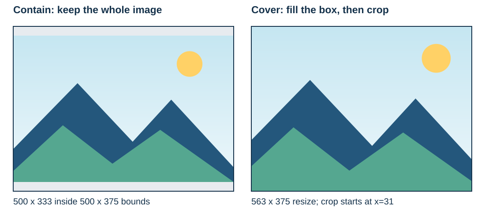

# Plan an image layout without stretching it

**Idraaak Image Fit** is a small Rust library that calculates proportional resize dimensions and centered crop rectangles. It is useful when your application needs to fit an image into a thumbnail, an article illustration, or a preview box.

The project is developed by [Idraaak](https://idraaak.com/), a website about computers, software, networking, and WordPress. This documentation explains the library's actual behavior, with examples you can run and numbers you can check.

## Choose how the image should fit

Start with one question: should the whole image remain visible, or should it fill every pixel of the box?

| Your requirement | Function | Result |
| --- | --- | --- |
| Keep the whole image, including its edges | `contain` | A size that fits inside the bounds; unused space may remain |
| Fill the complete box and remove excess edges | `cover` | A resize size followed by a centered crop rectangle |

Both modes use a single proportional scale. Pixel dimensions are integers, so rounding may change the exact ratio slightly. The library never applies a separate stretch to the horizontal or vertical dimension.

The illustration uses a **1200 x 800** source and **500 x 375** bounds. The gray area in contain is unused space; adding padding is your application's job. In cover, 31 pixels are removed from the left of the resized image and 32 from the right.

## What the library returns

`contain` returns a `Size`. `cover` returns a `CoverPlan` containing a resize `Size` and a `CropRect`. A separate image-processing library can then apply those values.

Idraaak Image Fit does not load, resize, compress, or write image files. It does not upload images, contact external services, or allocate image buffers. It performs geometry calculations only and has no third-party Rust dependencies.

## Start with a complete example

The [getting started page](getting-started.md) shows a Cargo dependency and a runnable example. Then use the [layout recipes](recipes.md) to compare landscape, portrait, and small-image cases.

If an operation fails, the [API and errors page](reference.md) explains the result and how to handle it without hiding the failure.

## Project information

- Current library release covered here: **0.1.0**.
- Minimum supported Rust version: **1.70**, edition **2021**.
- License: **MIT**.
- Source: [nedal-dev/idraaak-image-fit](https://github.com/nedal-dev/idraaak-image-fit).
- Package: [idraaak-image-fit on crates.io](https://crates.io/crates/idraaak-image-fit).
- Generated Rust API documentation: [docs.rs](https://docs.rs/idraaak-image-fit/latest/idraaak_image_fit/).

The documentation was prepared with AI assistance and checked against the library implementation and runnable examples. It is maintained with the project's source code.
